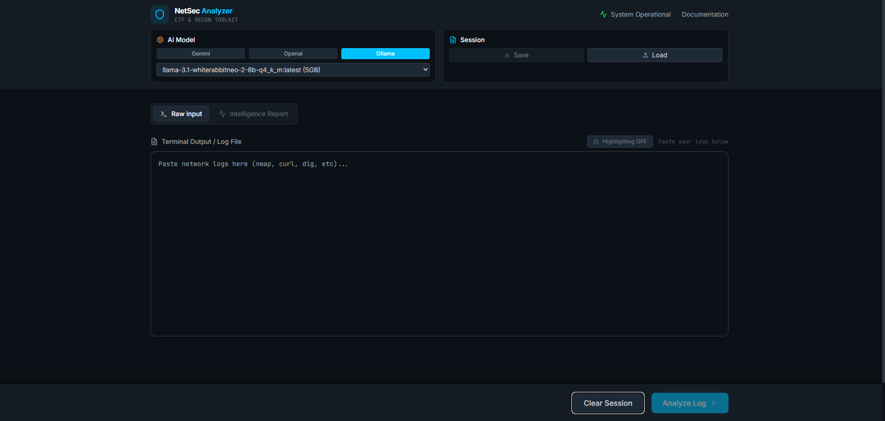
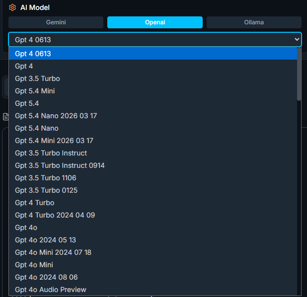
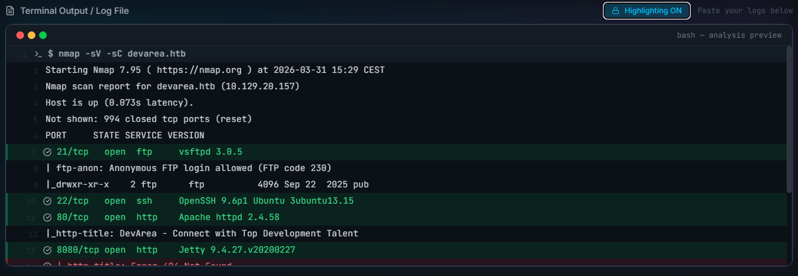
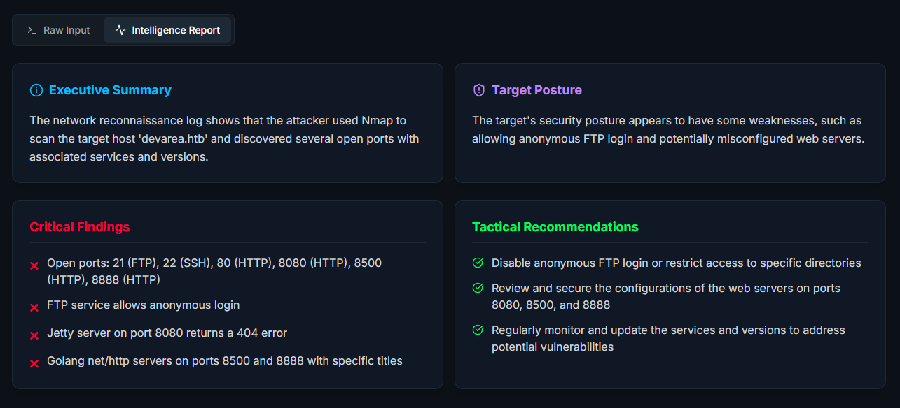

# NetSec Analyzer

A powerful web-based tool for analyzing network security logs and reconnaissance data using AI. Built with React, TypeScript, and modern web technologies.



## Features

### Core Functionality
- **AI-Powered Analysis**: Leverage multiple LLM providers (Gemini, OpenAI, Ollama) for intelligent log analysis
- **Multi-Provider Support**: Dynamic model fetching from Gemini, OpenAI, and local Ollama instances
- **Syntax Highlighting**: Terminal-style output with proper formatting and line numbers
- **Session Management**: Save and load analysis sessions for later review
- **Responsive Design**: Works seamlessly on desktop and mobile devices



### Analysis Capabilities
- **Network Reconnaissance**: Analyze nmap, curl, dig, and other network tool outputs
- **Security Assessment**: Identify potential vulnerabilities and security issues
- **CTF Support**: Perfect for Capture The Flag competitions and security challenges
- **Log Parsing**: Intelligent parsing of various log formats and structures



### User Interface
- **Modern Dark Theme**: Easy on the eyes for extended use
- **Intuitive Layout**: Clean, organized interface with controls in the header
- **Real-time Feedback**: Loading states and progress indicators
- **Error Handling**: Comprehensive error messages and recovery options



## Quick Start

### Prerequisites
- Node.js 20+ 
- npm, yarn, or pnpm

### Installation

1. Clone the repository:
```bash
git clone https://github.com/therealfredp3d/NetSec-Analyser.git
cd NetSec-Analyser
```

2. Install dependencies:
```bash
npm install
# or
yarn install
# or
pnpm install
```

3. Set up environment variables:
```bash
cp .env.example .env
```

4. Configure your API keys in `.env`:
```env
# For Gemini API
VITE_GEMINI_API_KEY=your_gemini_api_key_here

# For OpenAI API  
VITE_OPENAI_API_KEY=your_openai_api_key_here

# For Ollama (optional - local instance)
VITE_OLLAMA_BASE_URL=http://localhost:11434
```

5. Start the development server:
```bash
npm run dev
# or
yarn dev
# or
pnpm dev
```

6. Open your browser to `http://localhost:3000`

## Configuration

### API Providers Setup

#### Gemini (Google)
1. Get an API key from [Google AI Studio](https://makersuite.google.com/app/apikey)
2. Add `VITE_GEMINI_API_KEY` to your `.env` file
3. Models are fetched automatically from the Gemini API

#### OpenAI
1. Get an API key from [OpenAI Platform](https://platform.openai.com/api-keys)
2. Add `VITE_OPENAI_API_KEY` to your `.env` file
3. Models are fetched automatically from the OpenAI API

#### Ollama (Local)
1. Install [Ollama](https://ollama.ai/) on your local machine
2. Pull models: `ollama pull llama2` (or your preferred model)
3. Optionally set `VITE_OLLAMA_URL` if running on a different port/host

## Usage

### Basic Analysis
1. **Select AI Model**: Choose your preferred provider and model from the header controls
2. **Input Logs**: Paste your network logs, nmap results, or reconnaissance data in the input area
3. **Toggle Highlighting**: Enable syntax highlighting for better readability
4. **Analyze**: Click "Analyze Log" to process your data with AI
5. **Review Results**: View the comprehensive analysis report

### Session Management
- **Save Session**: Export your current analysis (logs + results) to a JSON file
- **Load Session**: Import previous analyses to continue work or review findings

### Supported Log Formats
- Nmap scan results
- curl command outputs
- dig/dns query results
- Web server logs
- Network traffic captures
- Custom log formats (AI will attempt to parse)

## Development

### Project Structure
```
NetSec-Analyser/
src/
  components/          # React components
    - AnalysisPanel.tsx
    - TerminalView.tsx
  services/           # API integration services
    - llmService.ts
  types.ts           # TypeScript type definitions
  App.tsx            # Main application component
  index.tsx          # Application entry point
```

### Available Scripts
- `npm run dev` - Start development server
- `npm run build` - Build for production
- `npm run preview` - Preview production build

### Building for Production
```bash
npm run build
npm run preview
```

The build will be optimized and ready for deployment to any static hosting service.

## API Integration Details

### Gemini Integration
- Uses Google's Generative AI SDK
- Supports all available Gemini models
- Automatic model discovery and selection

### OpenAI Integration  
- Uses OpenAI's official Node.js SDK
- Supports GPT-3.5 and GPT-4 models
- Chat completion API for analysis

### Ollama Integration
- Local model hosting
- Supports various open-source models
- No API keys required

## Environment Variables

| Variable | Required | Description |
|----------|----------|-------------|
| `VITE_GEMINI_API_KEY` | No | Google Gemini API key |
| `VITE_OPENAI_API_KEY` | No | OpenAI API key |
| `VITE_OLLAMA_BASE_URL` | No | Ollama server URL (default: http://localhost:11434) |

## Troubleshooting

### Common Issues

**API Key Errors**
- Verify your API keys are correct and active
- Ensure environment variables are prefixed with `VITE_`
- Check that your API keys have the necessary permissions

**Model Loading Issues**
- Verify your internet connection for cloud APIs
- For Ollama, ensure the service is running locally
- Check API rate limits and quotas

**Build Errors**
- Clear node_modules and reinstall: `rm -rf node_modules && npm install`
- Check Node.js version compatibility
- Verify all dependencies are installed

### Getting Help
- Check the [Issues](https://github.com/therealfredp3d/NetSec-Analyser/issues) page
- Review existing bug reports and feature requests
- Create a new issue with detailed information

## Contributing

We welcome contributions! Please see our [Contributing Guidelines](CONTRIBUTING.md) for details.

### Development Setup
1. Fork the repository
2. Create a feature branch: `git checkout -b feature/amazing-feature`
3. Make your changes
4. Commit your changes: `git commit -m 'Add amazing feature'`
5. Push to the branch: `git push origin feature/amazing-feature`
6. Open a Pull Request

## License

This project is licensed under the MIT License - see the [LICENSE](LICENSE) file for details.

## Acknowledgments

- Google Generative AI team for the Gemini API
- OpenAI for the GPT models
- Ollama team for local model hosting
- Lucide React for the beautiful icon set
- Vite for the fast development experience

## Changelog

### v0.1.0 (Initial Release)
- AI-powered log analysis with multiple provider support
- Dynamic model fetching and selection
- Terminal syntax highlighting
- Session management (save/load)
- Responsive dark theme UI
- Comprehensive error handling
- Production-ready build system

---

**Built with security professionals in mind. Perfect for CTF competitions, penetration testing, and network security analysis.**
